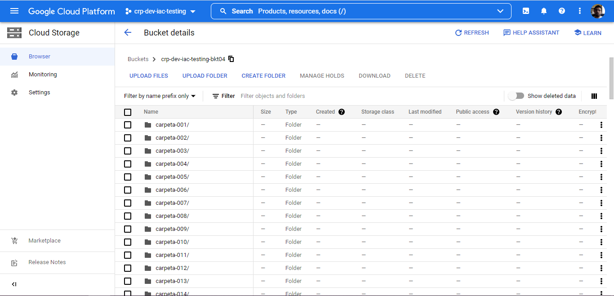
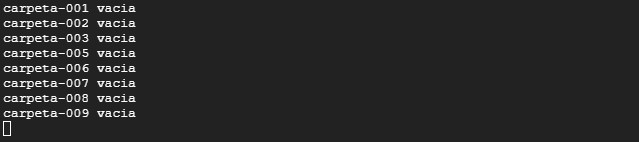
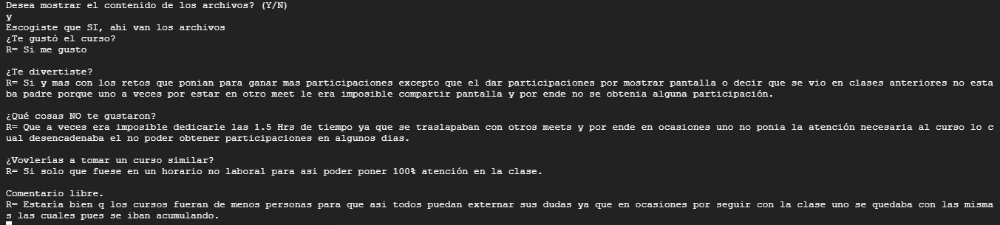
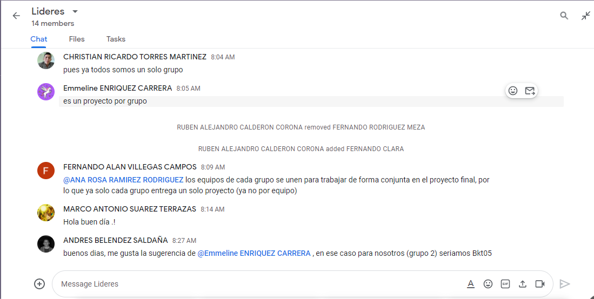

<font face="arial">
  <h1 align="center">PROYECTO FINAL</h1>
</font>

<p align="center">


</p>

<div align="center">
  
|  Colaborador |   Actividad  |  
| ------------ | ------------ | 
| Luis Alfredo Bautista Posadas| ¡¡Aprogramar!!, Consintiendo al profe |
| Ruben Alejandro Calderon Corona| ¡¡Aprogramar!!, Consintiendo al profe |
| Ariana Garcia
| Enrique Guzmán Cázares
| Diana Ortega Muñoz
| Maria Elena Coronado Rodriguez
| Evelin Cheyen Zepeda Hernández | Readme |
| Karla Ivonne Cuevas
| Daniel Amador
| Hector Francisco Ulloa Muñoz
| Juan Carlos Martinez
| Edgar Augusto Almonasi Santos
| Miguel Adrian Gabriel Morales
| Eduardo Munguia | Push y mi anotación del curso|
| Christian Ricardo Torres | push y mi anotación del curso|
| Luis Adrian Lara Sosa 
| Axael Zelanda salazar
| Ivan Gildardo Zarate Resendiz
| Antonio Montiel Patiño
| Cristian Jovani Gallegos Villaseñor
| Luis Enrique Vidaurri Clavijo
| Noe Fávila Domínguez
| Diego Eduardo Eulogio Pedraza
 
 </div align="center">

 ### Evidencia


<details><summary><b>Crear Carpetas</b></summary>

## Crear_carpetas.sh 

```
#!/bin/bash
crear_directorios() {

gsutil mb -p crp-dev-iac-testing -c STANDARD -l US-EAST4 -b on gs://crp-dev-iac-testing-bkt04 

for i in {1..9} ; do
    mkdir carpeta-00$i  
    touch carpeta-00$i/sinceramente.txt
    gsutil cp -r carpeta-00$i gs://crp-dev-iac-testing-bkt04
    echo “Creación de directorios terminado“ 
    rm -r carpeta-00$i
done
for i in {10..100} ; do
    if [ “$i” = “100” ]; then 
        mkdir carpeta-$i 
        touch carpeta-$i/sinceramente.txt
        gsutil cp -r carpeta-$i gs://crp-dev-iac-testing-bkt04
        echo “Creación de directorios terminado“ 
        rm -r carpeta-$i
    else
        mkdir carpeta-0$i 
        touch carpeta-0$i/sinceramente.txt
        gsutil cp -r carpeta-0$i gs://crp-dev-iac-testing-bkt04
        rm -r carpeta-0$i
    fi     
done 
}
crear_directorios;
```

<kbd>
 
 </kbd>

</details>


<details><summary><b>Logs</b></summary>

## Logging.sh

```
#!/bin/bash
# grupo-##-fecha-hora.log
#Programa que guarda en el log que carpetas contienen un archivo no vacio
# y que guarda el usuario y la distribucion de linux en un archivo generado con fecha y hora

ARCHIVO=grupo-01-$(date +%d-%m-%Y)-$(date +%H:%M).log

funciondatos(){
DISTRIBUCION=$(lsb_release -a)
USUARIO=$(gcloud config list account)
#DISTRIBUCION_2=$(cat /etc/*-release)

#echo $DISTRIBUCION

echo > $ARCHIVO
echo "GRUPO 01" >> $ARCHIVO
echo $USUARIO >> $ARCHIVO
echo $DISTRIBUCION >> $ARCHIVO
}


funcionvacios(){
for i in {1..10};do
    VAR=$(gsutil du -sh gs://crp-dev-iac-testing-bkt04/carpeta-00$i/ | awk '{printf $1}')
    if [ "$VAR" -ne "0" ];then
        echo "carpeta-00$i NO vacia" >> $ARCHIVO
    else
        echo "carpeta-00$i vacia"
    fi
done
}

funciondatos
funcionvacios

```

<kbd>
 
 </kbd>

</details>


<details><summary><b>Consintiendo al profe</b></summary>


## Consintiendo al profe

```
#!/bin/bash
#Se coloco un time de 0.5 para q pasase rapido el muestreo de los archivos

echo "Desea mostrar el contenido de los archivos? (Y/N)"
read -r a
if [ "$a" = "Y" -o "$a" = "y" ]; then
    echo "Escogiste que SI, ahi van los archivos";
    for i in {1..100};do
        if [ $i -lt 10 ]; then
            gsutil cat gs://crp-dev-iac-testing-bkt04/carpeta-00$i/sinceramente.txt
        fi
        if [ $i -gt 9 -a $i -lt 100 ]; then
            gsutil cat gs://crp-dev-iac-testing-bkt04/carpeta-0$i/sinceramente.txt
        fi
        if [ $i -eq 100 ]; then
            gsutil cat gs://crp-dev-iac-testing-bkt04/carpeta-$i/sinceramente.txt
        fi
        sleep 0.5
    done 
else 
    echo "Escogiste que NO";
fi
```


## Consintiendo_al_profe.sh

<kbd>

</kbd>
 </details>


#### Trabajo en equipo
Comunicación con otros equipos:
<kbd>
 
 </kbd>
 


